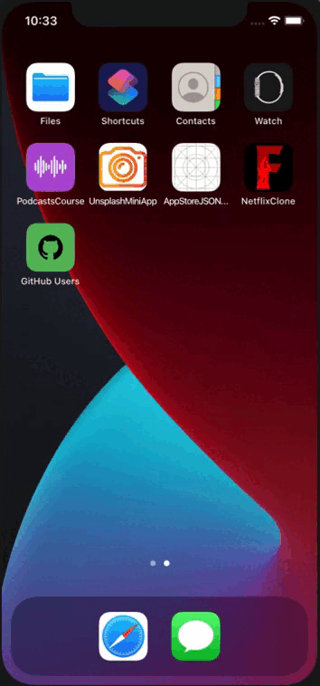
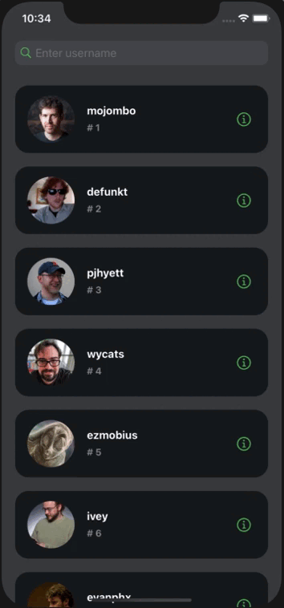

# About
  This project is a test task from <a href="https://kiparo.com/test-task-examples-for-android-ios">here</a>. This app allows you to find every user on Github, to look at detailed information and to go to his profile on the site.

  In this task, I additionally implemented a couple of features, such as a floating button which allows you to return to the very top of the list, "Go to profile" button and the ability to search, of course.
  
# Overview
 <table>
    <thead>
        <tr>
            <th>Pagination</th>
            <th>Pull-Refresh</th>
            <th>Search</th>
        </tr>
    </thead>
    <tbody>
        <tr>
            <td>
                
            </td>
            <td>
                
            </td>
                        <td>
                
            </td>
        </tr>
    </tbody>
</table>

# Technologies
  * Swift 5
  * UIKit
  * MVP
  * Auto Layout (programmatically)
  * SPM
  * <a href="https://github.com/Alamofire/Alamofire">Alamofire</a>
  * <a href="https://github.com/onevcat/Kingfisher">Kingfisher</a>
  * <a href="https://docs.github.com/ru/rest/users/users?apiVersion=2022-11-28#get-a-user">API</a>
  * Design in Figma
  
# Requirements
  * iOS 14.0+
  * Xcode 9.3+
